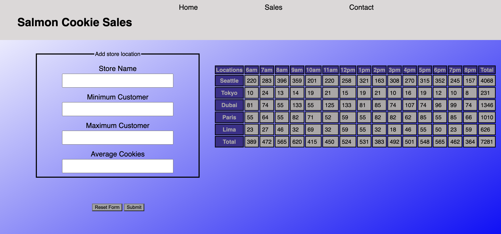

# Salmon Cookies using Vue.js

## Authors: Justin Mathieu and Tricia Sawyer

## Project

The goal of this project was to reimagine our previous Salmon Cookies application using Vue.js, a modern JavaScript framework that we self-taught.

Vue.js gained significant popularity by 2021, known for its simplicity, ease of integration, and well-thought-out framework design. At that time, it boasted a thriving community with numerous developers using it to create a variety of web applications.

### Vue.js

As of 2021, Vue.js was renowned for its:

- Simplicity: Vue.js made complex web development tasks more approachable and less daunting.
- Ease of Integration: It seamlessly integrated with existing projects, making it a practical choice for enhancing our Salmon Cookies application.
- Strong Community: Vue.js had a rapidly growing and supportive community, providing valuable resources and assistance.

### Customize configuration

For detailed configuration information, please refer to the [Vite Configuration Reference](https://vitejs.dev/config/).

### Project Setup

To set up the project, follow these steps:

1. Run `npm install` to install the neccessary dependencies.
2. Execute `npm run dev` to start the develomoent server.

### Features

Routes:

Our application comes with the following routes:

- `/` - Home
- `/sales` - Sales
- `/contact` - Contact

### UML Diagram

### Deployment

You can check out our deployed Vue-SalmonCookies application on [Code sandbox](https://jqpn3f-5173.csb.app/)

### Links and Resources

For more information about Vue.js, please visit the official [Vue.js Documentation](https://vuejs.org/guide/introduction.html)
